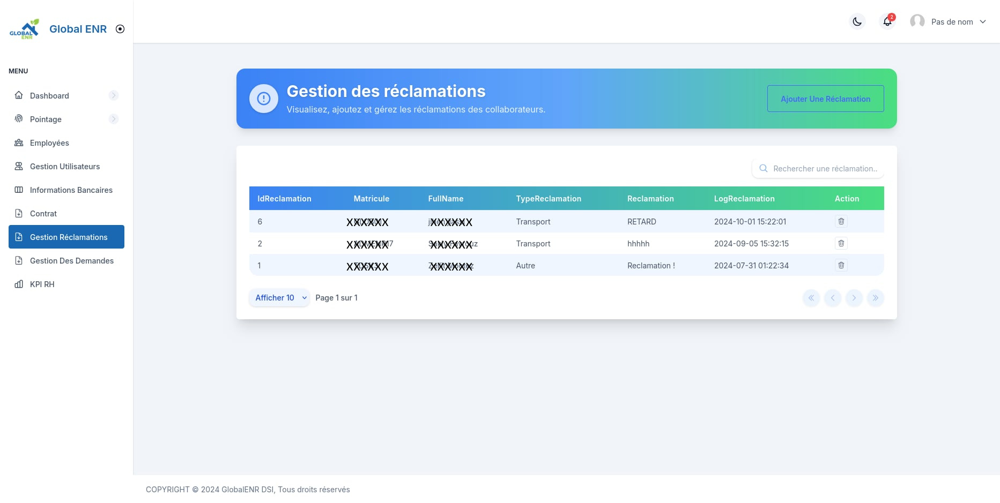

# ERPTEST-V-1-Intelligent-Human-Resource-Management-Platform
ERPTEST-V-1 is a comprehensive HR management solution designed to modernize, automate, and digitize the internal processes of a growing company. Built as an internal ERP, it centralizes employee management, contract tracking, performance indicators (KPIs), and internal communication.

# 🚀 ERPTEST-V-1 – Intelligent Human Resource Management Platform

ERPTEST-V-1 is a full HR Management Platform designed to digitize, modernize, and automate internal HR operations within a growing company.
It centralizes employee data, contracts, attendance, KPI analytics, and internal communication.

⚠️ Note: Source code is private due to company confidentiality.
This README provides a full professional overview of the system capabilities.

---

📘 Table of Contents

Vision & Objectives

Impact on the Organization

Digital Transformation Highlights

Key Innovations

Screenshots

Tech Stack

Architecture Overview

Achievements

Future Enhancements

Author

Confidentiality Notice

##  Vision & Objectives

Before ERPTEST-V-1, HR operations relied on:

Manual Excel sheets

Scattered documents (emails, drives, folders)

No centralized contract tracking

No performance scoring system

Weak internal communication

Goal: Unify all HR operations into a single intelligent ERP platform.

✔ Key Objectives

Automate administrative processes

Centralize employee records

Manage contracts (CDD, CDI, CIVP) with auto-generated PDFs

Provide smart KPI dashboards

Offer a communication channel via HR blog

Improve decision-making with analytics

---

1. Administrative Efficiency

Reduced HR workload by 40%

Eliminated document loss and manual tracking

Automatic PDF contract generation

2. Better Internal Communication

Corporate blog (announcements, HR communications)

Automated birthday posts (cron jobs) 🎉

Higher engagement + unified culture

3. Time Saving & Traceability

All documents retrievable in seconds

Complete history of every HR action

Automatic CSV imports for attendance

4. Performance Monitoring

KPI dashboard with weighted scoring

Analytics by department, age, gender, status

Real-time visual insights

5. Compliance & Security

JWT authentication

Role-based access control

Dockerized deployment & .env isolation 

---

## ⚙️ Digital Transformation Highlights

| Before ERPTEST-V-1                 | After ERPTEST-V-1                     |
| ---------------------------------- | ------------------------------------ |
| Multiple Excel files & emails      | Unified web interface                |
| Manually written contracts         | Automatic PDF generation             |
| Minimal internal communication     | HR blog + automated posts            |
| Manual attendance entry            | CSV import + smart parsing           |
| No analytics                       | Rich KPI dashboards                  |

---

##  Key Innovations

🔁 Automated cron jobs (birthdays, announcements)

🧾 Secure contract PDF generation

📊 Dynamic KPI module (MongoDB)

📥 Automated CSV attendance import

🐳 Dockerized architecture

🗂 Multi-role access system

📡 Modular backend for scalability 

---

1️⃣ Dashboard – Global HR Overview

Shows:

- Total employees  
- Departments  
- Job titles  
- Gender & status repartition  
- Salary and age analytics  

2️⃣ Employee Management Table

Includes:

- Matricule  
- Photo  
- Status  
- Department  
- Role  
- Actions  
- Advanced filters  

3️⃣ Add / Edit Employee Form

4️⃣ Contract Module (CDD / CDI / CIVP)

Example Contract (PDF Preview):

5️⃣ Blog – Internal Communication Platform

Features:

- HR announcements  
- Birthday auto-posts  
- Team updates  

6️⃣ Attendance / Pointage

7️⃣ KPI Module

8️⃣ Bank Information Module

9️⃣ HR Requests (Demandes)

🔟 Reclamations / Complaints

1️⃣1️⃣ System Menu

---

##  Role & Personal Contributions

**Bayrem Boussaidi – Full-Stack Developer**

Responsible for the **complete backend (Node.js / Express.js)** and **frontend (Angular)** development, including database design, route security, and automation workflows.

**Main contributions:**

- Designed backend architecture (`routes`, `services`, `uploads`)  
- Developed **Blog module** (CRUD + cron automation)  
- Integrated **KPI module** (performance computation + MongoDB)  
- Automated **contract PDF generation** by contract type (CDD/CDI/CIVP)  
- Implemented **JWT-based role & permission control**  
- Built Angular UI components for HR dashboard  
- Dockerized project and authored full technical documentation  

---

## 🧩 Tech Stack

| Area                | Technologies                       |
| ------------------- | ---------------------------------- |
| **Frontend**        | Angular, TypeScript, SCSS, PrimeNG |
| **Backend**         | Node.js, Express.js                |
| **Database**        | MySQL (XAMPP), MongoDB (KPI)       |
| **Security**        | JWT, dotenv, checkRole middleware  |
| **Automation**      | node-cron, multer                  |
| **PDF / Docs**      | pdfkit                             |
| **Deployment**      | Docker, docker-compose             |

---

## Achieved Results

📉 40% faster HR operations

📁 10,000+ documents centralized

🔄 Automation of major HR workflows

🧾 100% contract digitization

💬 +25% employee engagement

---

##  Future Enhancements

- Internal **HR ↔ Employee chat system**  
- Advanced **AI-based analytics** for predictive performance insights  
- Integration with external APIs (payroll, leave management, etc.)  
- Unified access management via **Keycloak dashboard**  

---

##  Author

**Bayrem Boussaidi**  
Software Developer — DevOps | Node.js | Angular | Docker  
📍 Tunisia  
📧 [bayrem.boussaidi@example.com](mailto:bayremboussaidi187@gmail.com )  
🔗 [LinkedIn](https://linkedin.com/in/bayrem-boussaidi)  
🖥️ [Portfolio](https://your-portfolio-link.com)

---

## 🔒 Confidentiality Notice

> **Source Code Privacy**  
> The full source code of **ERPTEST-V-1** is **private and confidential**.  
> This project was developed during a professional internship and is protected under the company’s **intellectual property and data protection policies**.  
>  
> Repository access is **restricted** and available **only upon formal professional request**.  
>  
> © 2025 — All rights reserved to the company and the author, *Bayrem Boussaidi*.
