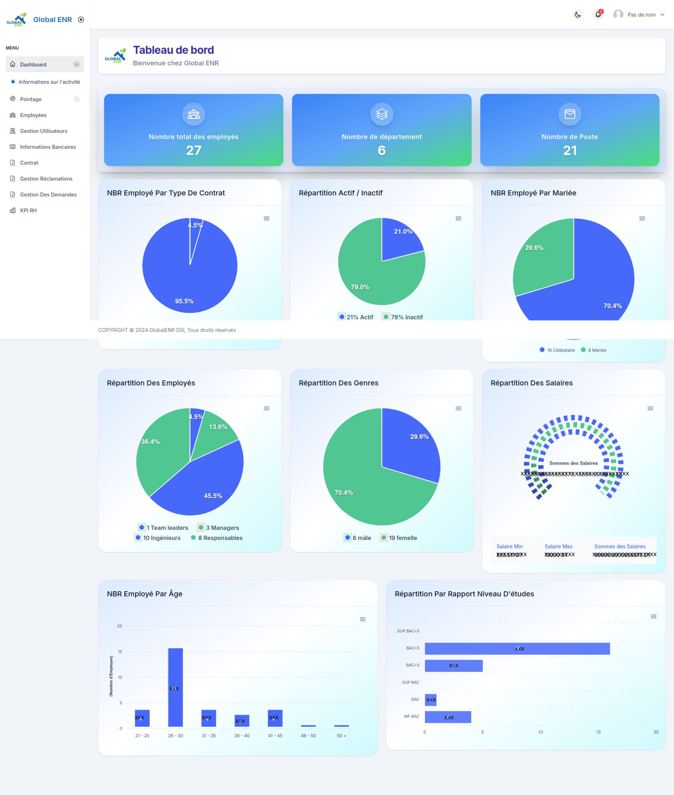
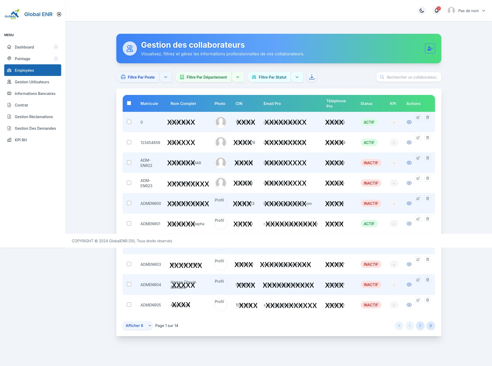
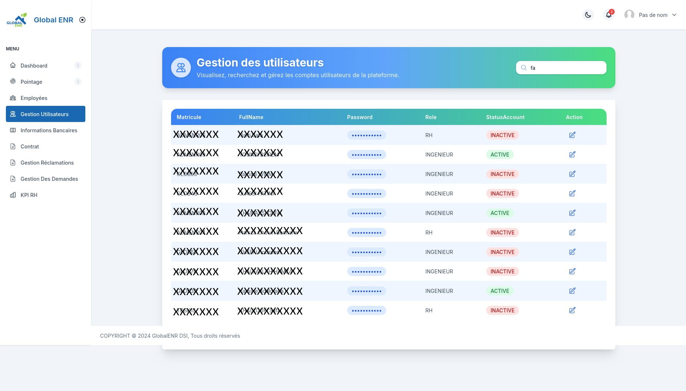
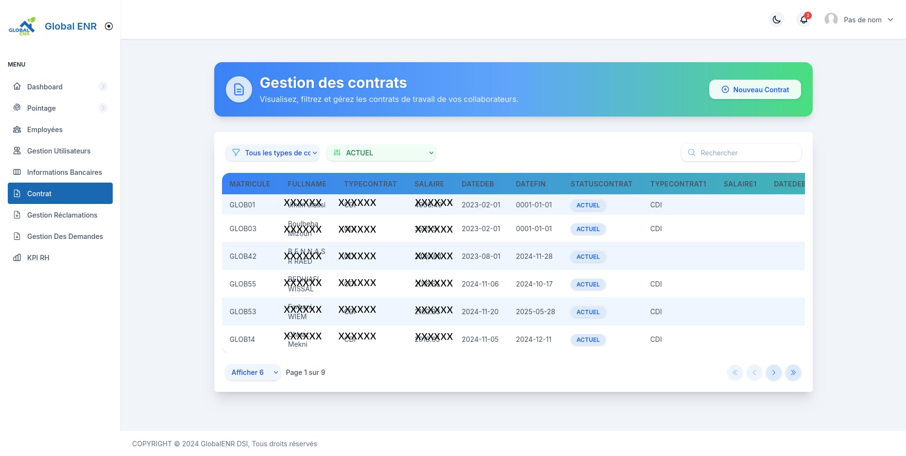
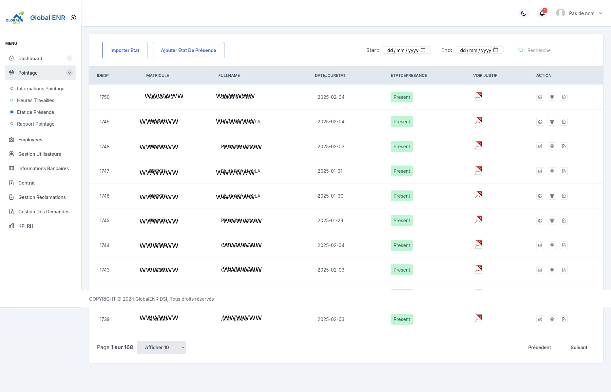
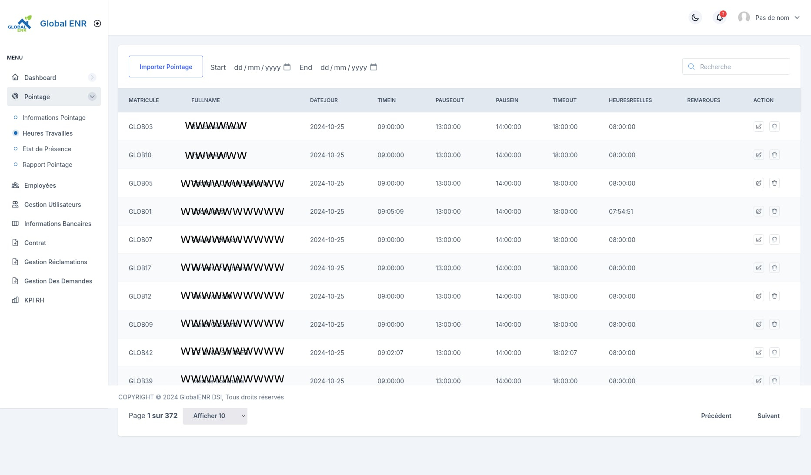
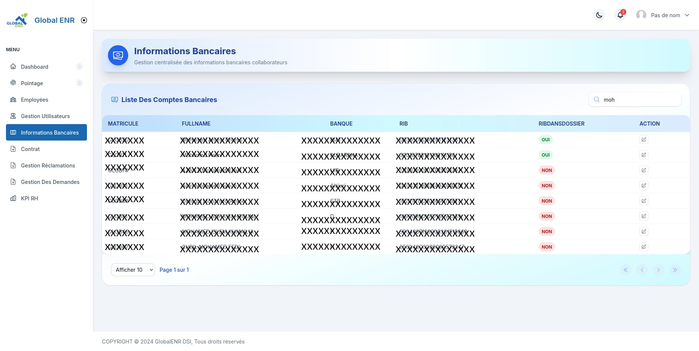
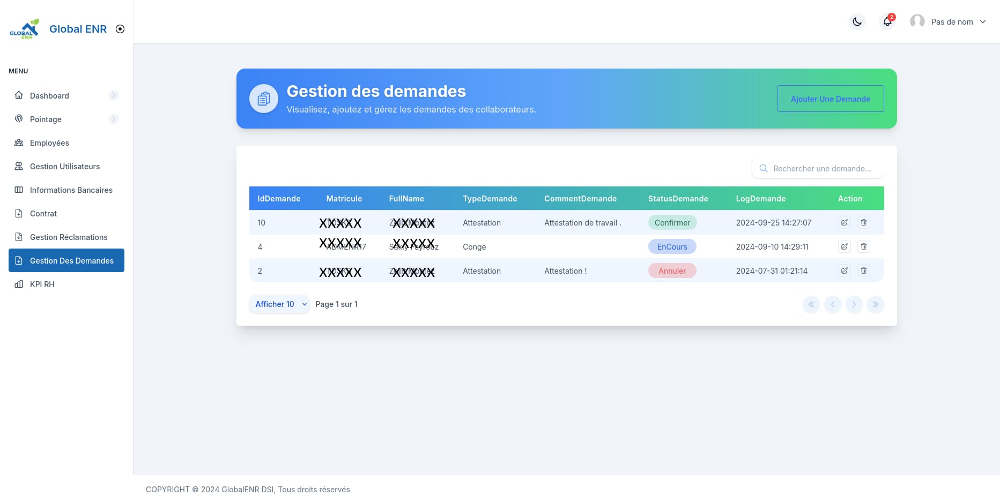

# ERPTEST-V-1 — Intelligent Human Resource Management Platform

ERPTEST-V-1 is a comprehensive HR management solution designed to modernize, automate, and digitize internal HR processes. It centralizes employee management, contract tracking, performance monitoring, and internal communication. This project was developed for [Global Enr](https://www.linkedin.com/company/globalen).

---

## Table of Contents

- [Overview](#overview)  
- [Impact & Benefits](#impact--benefits)  
- [Key Features](#key-features)  
- [Screenshots](#screenshots)  
- [Tech Stack](#tech-stack)  
- [Deployment](#deployment)  
- [Future Enhancements](#future-enhancements)  
- [Author](#author)  

---

## Overview

ERP operations before ERPTEST-V-1 relied on manual Excel sheets, scattered documents, and no centralized tracking. ERPTEST-V-1 aims to:  

- Centralize employee records and HR workflows  
- Automate contract generation and attendance tracking  
- Provide KPI dashboards and analytics  
- Enable internal communication through a blog  
- Improve decision-making through data insights  

---

## Impact & Benefits

- **Efficiency:** Reduced HR workload by 40%, automated document handling  
- **Communication:** Corporate blog for announcements and automated posts  
- **Traceability:** Full history of HR actions, fast document retrieval  
- **Performance:** KPI dashboards by department, age, gender, and status  
- **Security:** JWT authentication, role-based access, Dockerized deployment  

---

## Key Features

- Automated PDF contract generation  
- Dynamic KPI module  
- Automated CSV attendance import  
- Dockerized architecture for consistent deployments  
- Multi-role access system  
- Modular backend for scalability  

---

## Screenshots

| Feature | Screenshot |
| ------- | ---------- |
| Dashboard |  |
| Employee Management |  |
| Add/Edit Employee |  |
| Contract Module |  |
| Blog & Communication |  |
| Attendance / Pointage |  |
| KPI Module |  |
| Bank Info |  |
| HR Requests |  |

---

## Tech Stack

| Layer | Technologies |
| ----- | ------------ |
| Frontend | Angular, TypeScript, SCSS, PrimeNG |
| Backend | Node.js, Express.js |
| Database | MySQL, MongoDB (KPI) |
| Security | JWT, dotenv, role-check middleware |
| Automation | node-cron, multer |
| PDF / Documents | pdfkit |
| Deployment | Docker, docker-compose |

---

## Deployment

For deployment, the project uses Docker. **Sensitive information like database passwords is not included here**.  

Generic Docker Compose example:

```yaml
version: "3"

services:
  frontend:
    build: ./FrontSide
    ports:
      - 3000:3000
    depends_on:
      - backend

  backend:
    build: ./backendSide
    ports:
      - 3001:3001
    environment:
      - DB_HOST=db
      - DB_USER=<your-db-user>
      - DB_PASSWORD=<your-db-password>
      - DB_DATABASE=<your-db-name>
    depends_on:
      - db

  db:
    image: mysql:8.0
    environment:
      - MYSQL_ROOT_PASSWORD=<your-root-password>
      - MYSQL_DATABASE=<your-db-name>
    volumes:
      - mysql_data:/var/lib/mysql  

volumes:
  mysql_data:

To run:

docker-compose up -d --build


Replace <your-db-user>, <your-db-password>, and <your-db-name> with your secure internal credentials.

Author

Bayrem Boussaidi
Software Developer — DevOps | Node.js | Angular | Docker
Email: bayremboussaidi187@gmail.com

LinkedIn: linkedin.com/in/bayrem-boussaidi
